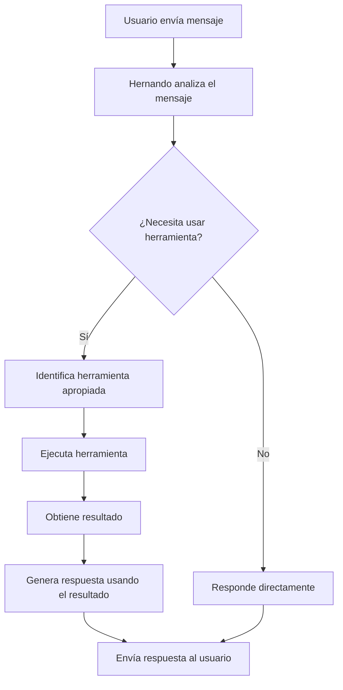

# Herramientas de Hernando - Function Calling

Hernando ahora cuenta con **Function Calling** de OpenAI, lo que le permite ejecutar acciones específicas además de responder preguntas.

## 🔧 Herramientas Disponibles

### 1. **enviar_formulario_contacto**
Envía formularios de contacto al equipo de Fundo Moraga.

**Cuándo se usa:**
- Usuario quiere cotizar un evento
- Usuario desea hacer una reserva
- Usuario necesita información específica que requiere contacto humano

**Parámetros:**
- `nombre`: Nombre completo
- `email`: Email de contacto
- `telefono`: Teléfono (opcional)
- `tipo_solicitud`: evento | actividad_offroad | visita | produccion | otro
- `mensaje`: Consulta o solicitud
- `fecha_tentativa`: Fecha en formato YYYY-MM-DD (opcional)

**Ejemplo de uso:**
```
Usuario: "Quiero cotizar un evento corporativo para 50 personas el 20 de enero"
Hernando: [Usa la herramienta para enviar el formulario]
```

---

### 2. **buscar_informacion_historica**
Busca información detallada sobre la historia de la Familia Moraga.

**Cuándo se usa:**
- Usuario pregunta por eventos históricos específicos
- Usuario quiere saber sobre personajes históricos
- Usuario consulta sobre propiedades históricas

**Temas disponibles:**
- `conquista`: Llegada a Chile (1551)
- `guerra_arauco`: Participación en la Guerra de Arauco
- `independencia`: Participación en la Independencia de Chile
- `batalla_chacabuco`: Batalla de Chacabuco y la hacienda
- `rodeo_chileno`: Tradición en el rodeo chileno
- `hacienda_nancagua`: Historia de la Hacienda de Nancagua
- `hacienda_chacabuco`: Historia de la Hacienda de Chacabuco
- `fundo_batuco`: Historia del Fundo Moraga en Batuco
- `hernando_moraga`: Sobre el fundador del linaje
- `familia_general`: Historia general de la familia

**Ejemplo de uso:**
```
Usuario: "Cuéntame sobre la participación en la Independencia"
Hernando: [Usa la herramienta para obtener info detallada]
```

---

### 3. **informar_actividades_disponibles**
Proporciona información detallada sobre actividades y servicios.

**Cuándo se usa:**
- Usuario pregunta qué puede hacer en el fundo
- Usuario consulta por tipos de eventos
- Usuario quiere saber sobre actividades específicas

**Tipos de actividad:**
- `eventos`: Eventos corporativos y privados
- `offroad`: Actividades todoterreno (Batuco Off Road)
- `turismo_rural`: Experiencias de naturaleza y patrimonio
- `produccion_audiovisual`: Locaciones para producciones
- `todas`: Información completa de todas las actividades

**Ejemplo de uso:**
```
Usuario: "¿Qué actividades off-road tienen?"
Hernando: [Usa la herramienta para explicar actividades off-road]
```

---

### 4. **obtener_contactos_oficiales**
Proporciona contactos según el tipo de consulta.

**Cuándo se usa:**
- Usuario pide contacto para cotizar
- Usuario necesita hacer una reserva
- Usuario requiere atención especial

**Motivos:**
- `cotizacion`: Para solicitar presupuestos
- `reserva`: Para hacer reservas
- `consulta_general`: Consultas generales
- `emergencia`: Situaciones urgentes
- `prensa`: Solicitudes de medios

**Ejemplo de uso:**
```
Usuario: "¿Cómo los contacto para cotizar?"
Hernando: [Usa la herramienta para dar contactos de cotización]
```

---

### 5. **verificar_acceso_fundo**
Explica las condiciones para acceder al fundo.

**Cuándo se usa:**
- Usuario pregunta si puede visitar
- Usuario quiere saber cómo llegar
- Usuario consulta sobre acceso público

**Ejemplo de uso:**
```
Usuario: "¿Puedo ir a visitar el fundo mañana?"
Hernando: [Usa la herramienta para explicar que requiere autorización]
```

---

## 🎯 Flujo de Function Calling



---

## 💡 Ejemplos de Conversaciones

### Ejemplo 1: Cotización de evento

**Usuario:** "Hola, quiero hacer un evento corporativo en marzo"

**Hernando:** "¡Hola! Excelente que consideres Fundo Moraga para tu evento corporativo. Para poder ayudarte mejor, necesito algunos datos. ¿Podrías proporcionarme:
- Tu nombre
- Email de contacto
- Número aproximado de personas
- Fecha tentativa

Con esa información te enviaré una cotización personalizada."

**Usuario:** "Claro, soy Juan Pérez, juan@empresa.cl, serían 80 personas para el 15 de marzo"

**Hernando:** [Ejecuta `enviar_formulario_contacto`]
"✅ Formulario enviado exitosamente. Hemos recibido tu solicitud. El equipo te contactará a juan@empresa.cl a la brevedad. También puedes escribirnos directamente a contacto@fundomoraga.com o WhatsApp +5694 1242609"

---

### Ejemplo 2: Consulta histórica

**Usuario:** "¿Qué relación tiene el fundo con la Batalla de Chacabuco?"

**Hernando:** [Ejecuta `buscar_informacion_historica` con tema="batalla_chacabuco"]
"La Hacienda de Chacabuco, propiedad de la familia Moraga, tuvo un papel clave en la Batalla de Chacabuco de 1817:
- Fue Cuartel General del Ejército de los Andes
- San Martín y O'Higgins se refugiaron allí tras la batalla
- Funcionó como hospital de sangre..."

---

### Ejemplo 3: Actividades off-road

**Usuario:** "¿Puedo llevar mi 4x4 al fundo?"

**Hernando:** [Ejecuta `informar_actividades_disponibles` con tipo="offroad"]
"¡Sí! Las actividades off-road en Fundo Moraga son operadas exclusivamente por Batuco Off Road. Ofrecen:
- Rutas 4x4 profesionales
- Experiencias de enduro
- Eventos de aventura motorizada
..."

---

## 🔐 Seguridad y Límites

### Hernando NO puede:
- ❌ Confirmar reservas definitivas
- ❌ Dar precios exactos
- ❌ Autorizar accesos al fundo
- ❌ Prometer disponibilidad
- ❌ Compartir información privada

### Hernando SÍ puede:
- ✅ Recolectar datos para formularios
- ✅ Proporcionar información histórica
- ✅ Explicar actividades disponibles
- ✅ Derivar a contactos oficiales
- ✅ Responder preguntas generales

---

## 📊 Monitoreo de Herramientas

Cuando Hernando usa una herramienta, los logs muestran:

```
🔧 Ejecutando herramienta: enviar_formulario_contacto
   Argumentos: {'nombre': 'Juan Pérez', 'email': 'juan@empresa.cl', ...}
📧 Formulario recibido: {...}
```

Esto permite monitorear qué herramientas se usan y con qué frecuencia.

---

## 🚀 Futuras Herramientas

Posibles herramientas a agregar:

- **consultar_disponibilidad**: Verificar fechas disponibles en calendario
- **calcular_estimacion**: Estimar costos aproximados según parámetros
- **enviar_notificacion_whatsapp**: Notificar al equipo vía WhatsApp
- **buscar_clima**: Consultar pronóstico del clima para fechas
- **generar_pdf_informativo**: Crear PDF con información del fundo

---

## 📚 Recursos

- [OpenAI Function Calling Docs](https://platform.openai.com/docs/guides/function-calling)
- [Best Practices for Function Calling](https://platform.openai.com/docs/guides/function-calling/best-practices)

---

**Actualizado:** Diciembre 2025
